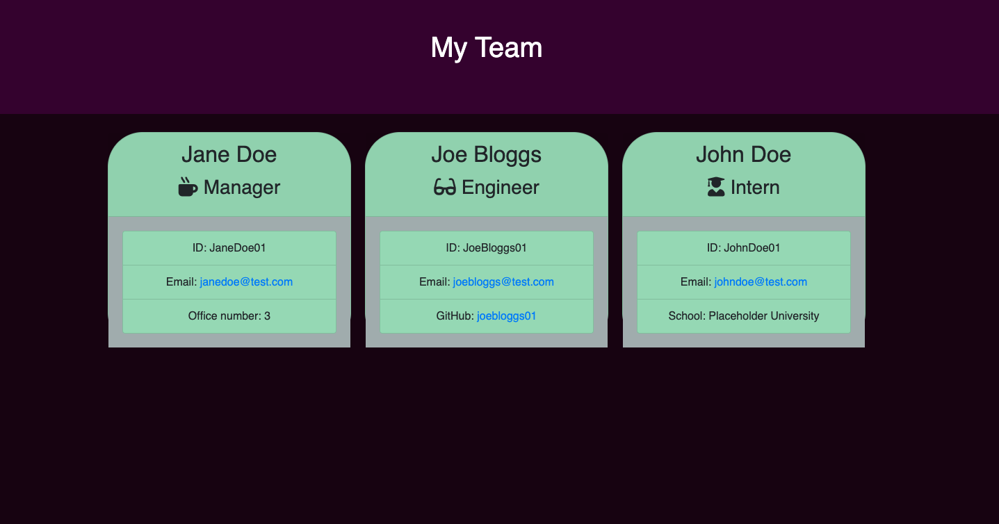

# Team Profile Generator

## Description

A Node.js command line application that prompts a user to input information about their team and then generates a HTML file allowing them to have quick and easy access to all the team's data such as email addresses and ID numbers.

## Screenshot

## Table of Contents

- [Description](#description)
- [Screenshot] (#screenshot)
- [Installation](#installation)
- [Usage](#usage)
- [Credits](#credits)
- [License](#license)
- [Contributing](#contributing)
- [Questions](#questions)

## Installation

For this application to work successfully, Node.js is required as well as the Inquirer and Jest packages. You can install these packages via the Terminal.

To install Inquirer run: npm install inquirer@^8.2.5
To install Jest run: npm install jest

## Usage

To get started, enter node index.js within the terminal. You will then be prompted to answer a series of questions about the Team's manager, following this you will be prompted to add another Employee to the team - An Engineer or Intern. Enter as many employees as you like, then when you are finished, select 'None' and your Team Profile HTML file will be generated.

## Credits

- NPM Package Inquirer - https://www.npmjs.com/package/inquirer
- NPM Package Jest - https://www.npmjs.com/package/jest

## License

## Questions

lauralp92 is my GitHub username.

Feel free to contact me with any questions at laura.pitcher92@gmail.com
